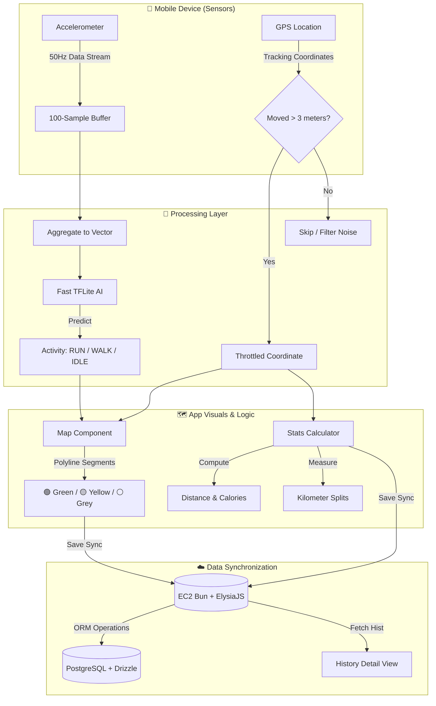

# 🏃‍♂️ FitPung (Frontend)

Hey there! Welcome to **FitPung**, a running and walking tracker application tailored to supply clean statistics and equipped with a secret superpower—an **on-device AI that classifies your motion** in real-time!

---

## 💡 What's Inside? (Key Features)

*   **📍 Color-Coded Route Mapper:** Jogging on the map produces beautiful colored paths (Polylines) based on your instant motion index:
    *   🟢 **Green**: Hard workers pushing for a **RUN**
    *   🟡 **Yellow**: Relaxed pacers out for a **WALK**
    *   ⚪ **Grey**: Taking a breather or standing **IDLE**
*   **🧠 On-device Activity Recognition (HAR AI):** We've baked in **Fast TFLite** inference directly inside the client bundle! It reads data surges from your accelerometer and predicts your movement locally—zero backend dependencies needed!
*   **📊 Performance Dashboard & Splits:** Milestone markers automatically dock at kilometer intervals, paired with a detailed splits table so you can analyze your pace mechanics.
*   **👟 Shoe Tracker:** Keeps track of mileage logged on your favorite kicks to help prevent over-use injuries and cushion your joints correctly.

---

## � System Architecture Flow



---

## �🛠️ The Tech Stack

*   **Framework:** React Native + Expo (Bare Workflow)
*   **Map Layer:** `react-native-maps`
*   **AI Engine:** `react-native-fast-tflite`
*   **Sensors:** `expo-sensors`
*   **Package Manager:** Bun 🚀

---

## ⚙️ Development Setup

1. **Install Dependencies:**
   ```bash
   bun install
   ```

2. **Configure Environment Variables (`.env`):**
   Create a file named `.env` in the root directory and plug these keys:
   ```properties
   EXPO_PUBLIC_API_URL=http://<Your_Backend_IP>:3001
   EXPO_PUBLIC_GOOGLE_MAPS_API_KEY=<Your_Google_Maps_API_Key>
   ```

---

## 🏃‍♂️ Spinning Up the App (Run)

*   **Android Stream:**
    ```bash
    bun run android
    ```
*   **iOS Stream:**
    ```bash
    bun run ios
    ```

---

## 📦 Bundling Standalone Release (Production APK/IPA)

When you need to take the app to a friend's phone without relying on the desktop bundler server:

### 🤖 **Android (Creating `.apk`):**
We highly recommend compiling through the **Local Native Gradle** node in your machine to bypass prebuild drops for continuous HTTP rules:
```bash
cd android && EXPO_PUBLIC_API_URL="http://<IP>:3001" EXPO_PUBLIC_GOOGLE_MAPS_API_KEY="<Your_Key>" JAVA_HOME="/Applications/Android Studio.app/Contents/jbr/Contents/Home" ./gradlew assembleRelease
```
*📍 Destination path:* `android/app/build/outputs/apk/release/app-release.apk`

### 🍎 **iOS (Direct sideloading to device):**
```bash
bunx expo run:ios --configuration Release --device
```
